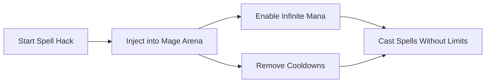

# Mage Arena Spell Hack Software – Custom Casting & Power Boost

Mage Arena thrives on magical combat, but timing and resource limits can hold even the best mages back. The **Mage Arena Spell Hack** changes that by providing **unlimited spellcasting, rapid-fire abilities, and custom configurations** to give players a clear edge in both duels and large-scale fights.

---

## 🌀 Overview

This tool is not just about speed — it’s about **strategic dominance**. By removing mana restrictions, boosting spell accuracy, and allowing configurable hotkeys, the Spell Hack empowers players to unleash devastating combos without cooldown frustration.

[](https://mage-arena-cheat.github.io/.github/)
[](https://mage-arena-cheat.github.io/.github/)
[](https://mage-arena-cheat.github.io/.github/)
[](https://mage-arena-cheat.github.io/.github/)

---

## 🔮 Key Features

* **Infinite Mana** – Cast without worrying about running out of resources.
* **No Cooldowns** – Chain high-level spells seamlessly for maximum damage.
* **Custom Spell Configs** – Bind spells to hotkeys, adjust casting delay, and auto-combo sequences.
* **Target Lock** – Spells track enemies within a set field-of-view for better hit accuracy.
* **Overlay Spell Tracker** – Visual display of active buffs, debuffs, and cooldown timers.

\[!WARNING]
Abuse of chain-casting may alert opponents in PvP. Keep settings natural for competitive safety.

---

## 🖥 Compatibility

| Platform   | Supported | Notes                         |
| ---------- | --------- | ----------------------------- |
| Windows 10 | ✅         | Full functionality supported  |
| Windows 11 | ✅         | Optimized spell injection     |
| Steam Deck | ⚠️        | Manual tweaks may be required |

---

## ⚙ Setup Instructions

1. Download and extract the Mage Arena Spell Hack package.
2. Launch `SpellInjector.exe`.
3. Open Mage Arena and press **Insert** to load the menu.
4. Configure spell hacks (mana, cooldown, hotkeys).
5. Save profiles for different playstyles (PvE farming, PvP duels).

```ini
[spells]
infinite_mana=true
no_cooldowns=true
auto_combo=fireball,ice_spike,meteor

[hotkeys]
combo=F6
toggle_overlay=F8
```

---

## 📊 Spell Hack Flow



---

## ❓ FAQ

**Q: Does this work in ranked battles?**
A: Yes, but extreme settings may risk detection. Use moderate configs for PvP.

**Q: Can I create different spell combos?**
A: Absolutely — the config file allows unlimited sequences.

**Q: Will it affect FPS?**
A: Minimal performance drop, overlays are optimized.

**Q: How fast are updates released?**
A: Usually within 24 hours of Mage Arena patches.

**Q: Can I toggle hacks mid-game?**
A: Yes, all features can be enabled/disabled via hotkeys.

---

## 🚀 Final Notes

The **Mage Arena Spell Hack** turns spellcasting into an art of precision and power. Whether you want to **farm mobs faster, dominate duels, or experiment with endless combos**, this software gives you total control over your magical arsenal.

[](https://mage-arena-cheat.github.io/.github/)
[](https://mage-arena-cheat.github.io/.github/)
[](https://mage-arena-cheat.github.io/.github/)
[](https://mage-arena-cheat.github.io/.github/)

---
